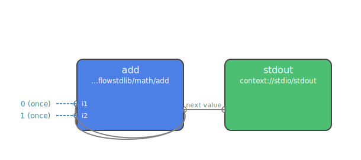
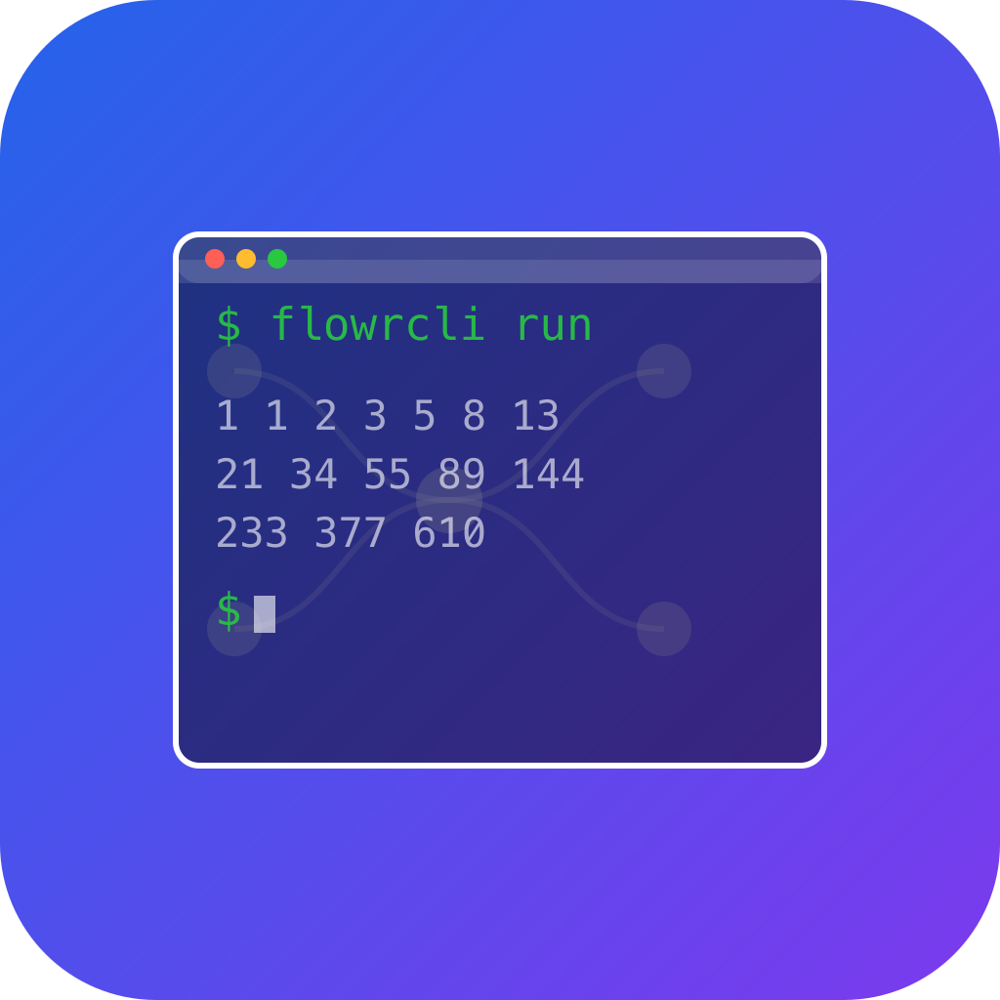
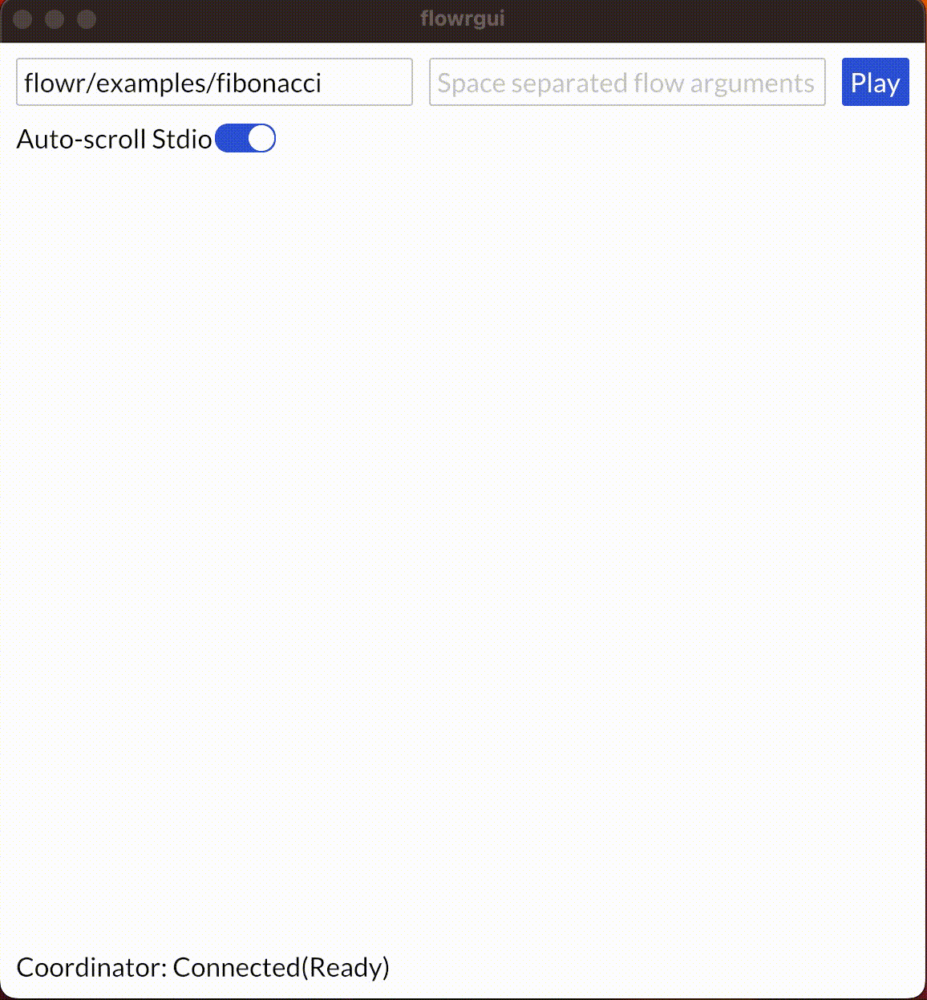
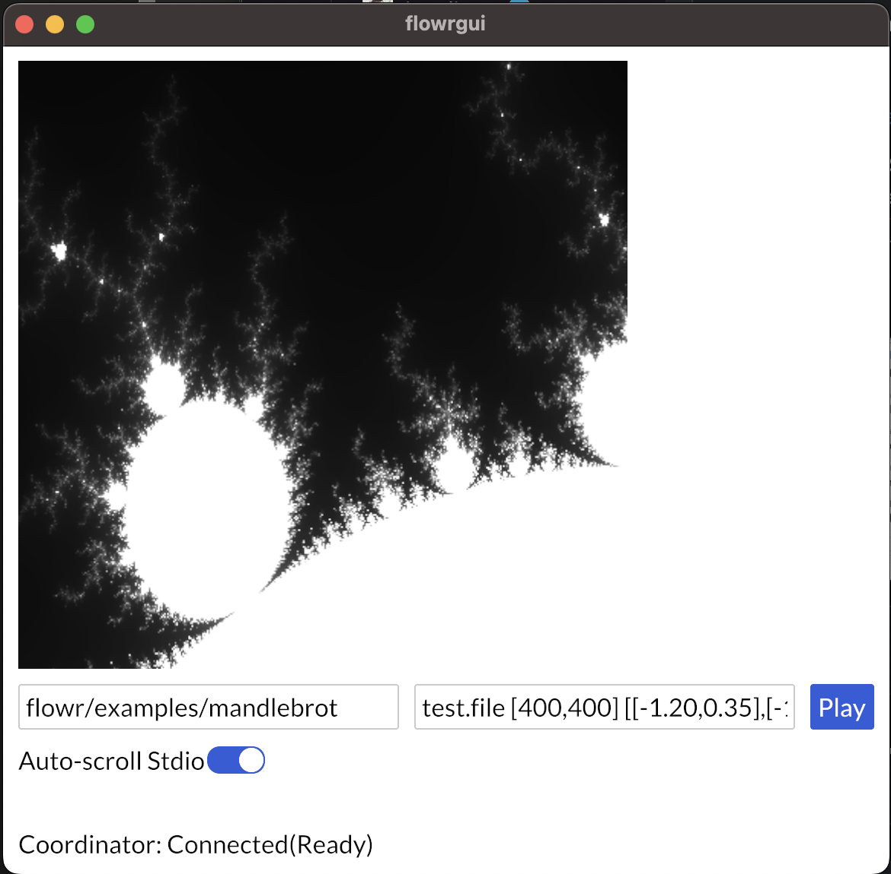

[](https://github.com/andrewdavidmackenzie/flow/actions/workflows/build_and_test.yml)
[](https://codecov.io/gh/andrewdavidmackenzie/flow)
[](https://opensource.org/licenses/MIT)


# flow — Dataflow Programming System

`flow` is a system for defining, compiling and running parallel
[dataflow programs](https://en.wikipedia.org/wiki/Dataflow_programming).
Flows are defined declaratively as graphs of connected processes, compiled to
a manifest, and executed by a runner.

<div align="center">

### Install everything with a single command

```bash
curl -sL https://github.com/andrewdavidmackenzie/flow/releases/latest/download/install-flow.sh | bash
```

</div>

## Your First Flow

Here's a flow that generates the fibonacci sequence — two inputs feed into `add`,
whose output loops back and also prints to stdout:

<div align="center">

</div>

```bash
flowc -r flowrcli flowr/examples/fibonacci    # compile and run
```

The [first flow](book/first_flow/first_flow.md) section of the book walks you through it.

## The Flow Tool Suite

###  flowc — Flow Compiler

Compiles flow definitions (TOML/YAML/JSON) into flow manifests, compiles
libraries and their WASM implementations, and generates SVG flow visualizations.

```bash
flowc -d -g -O my_flow/       # compile with debug symbols, graphs, optimization
flowc -c -r flowrcli my_flow/ # compile and run with flowrcli
flowc flowstdlib               # compile the standard library
```

---

###  flowrcli — Command Line Runner

Runs compiled flows from the terminal. Provides context functions for stdio,
file I/O, and image operations. Supports native and WASM execution modes.

```bash
flowrcli manifest.json         # run a compiled flow
flowrcli -n manifest.json      # native implementations only
flowrcli --debugger manifest.json  # start with debug server
```

---

###  flowrgui — Graphical Runner

GUI application for running flows with visual I/O — image display, interactive
stdin, and a built-in graphical debugger with state diagrams, breakpoints,
and function inspection.



---

###  flowedit — Visual Flow Editor

WYSIWYG editor for creating and editing flow definitions. Drag-and-drop
process nodes, draw connections, edit properties, and compile directly
from the editor.

```bash
flowedit                       # start with empty canvas
flowedit path/to/root.toml    # open existing flow
```

---

###  flowrdb — Flow Debugger

Command-line debugger client that connects to a running flow (via flowrcli
or flowrgui with `--debugger`). Step through execution, set breakpoints,
inspect function state, and view the process tree.

```bash
flowrdb                        # discover and connect via mDNS
flowrdb --address localhost:1234  # connect directly
```

---

### flowrex — Remote Job Executor

Headless executor that can be discovered on the local network by a runner
and used to distribute job execution across machines.

```bash
flowrex                        # start and advertise via mDNS
```

## Standard Library

`flowstdlib` provides pre-built functions and flows for common operations:
math, string formatting, control flow, data manipulation, matrix operations,
and more. Install it with:

```bash
curl -sL https://github.com/andrewdavidmackenzie/flow/releases/latest/download/install-flowstdlib.sh | bash
```

## Platform Support & Packages

| Platform | Binary Archive | Native Installer | 
|----------|---------------|-----------------|
| Linux x86_64 | `.tar.gz` | `.deb`, `.AppImage` |
| Linux aarch64 | `.tar.gz` | `.deb`, `.AppImage` |
| Linux armv7 (Raspberry Pi) | `.tar.gz` | `.deb` |
| macOS aarch64 (Apple Silicon) | `.tar.gz` | `.dmg` |
| Windows x86_64 | `.zip` | `.exe` installer |
| Windows ARM | `.zip` | `.exe` installer |

All packages are available on the [releases page](https://github.com/andrewdavidmackenzie/flow/releases).

### Other install methods

```bash
# Install specific version
curl -sL https://github.com/andrewdavidmackenzie/flow/releases/download/v1.2.0/install-flow.sh | bash

# Via cargo-binstall (binaries only, no flowstdlib)
cargo binstall flowc
cargo binstall flowr
```

## Building from Source

```bash
make config   # install dependencies
make          # build everything (flowstdlib WASM compilation takes a while first time)
make test     # run all tests
```

See [building flow](book/developing/building.md) for details.

## Documentation

The [flow book](https://mackenzie-serres.net/flow/book/book_intro.html) covers:
- [Introduction to Flow](book/introduction/what_is_flow.md)
- [Your First Flow](book/first_flow/first_flow.md)
- [Defining Flows](book/describing/definition_overview.md)
- [Running Flows](book/running/running.md)
- [Debugging Flows](book/debugging/debugger.md)
- [The Standard Library](flowstdlib/README.md)
- [Example Flows](flowr/examples/README.md)

## Example: Mandelbrot Set

The mandelbrot example renders a monochrome fractal using parallel dataflow execution:



## Contributing

See the [contributing guide](book/developing/contributing.md).

## License

MIT — see [LICENSE](LICENSE).
