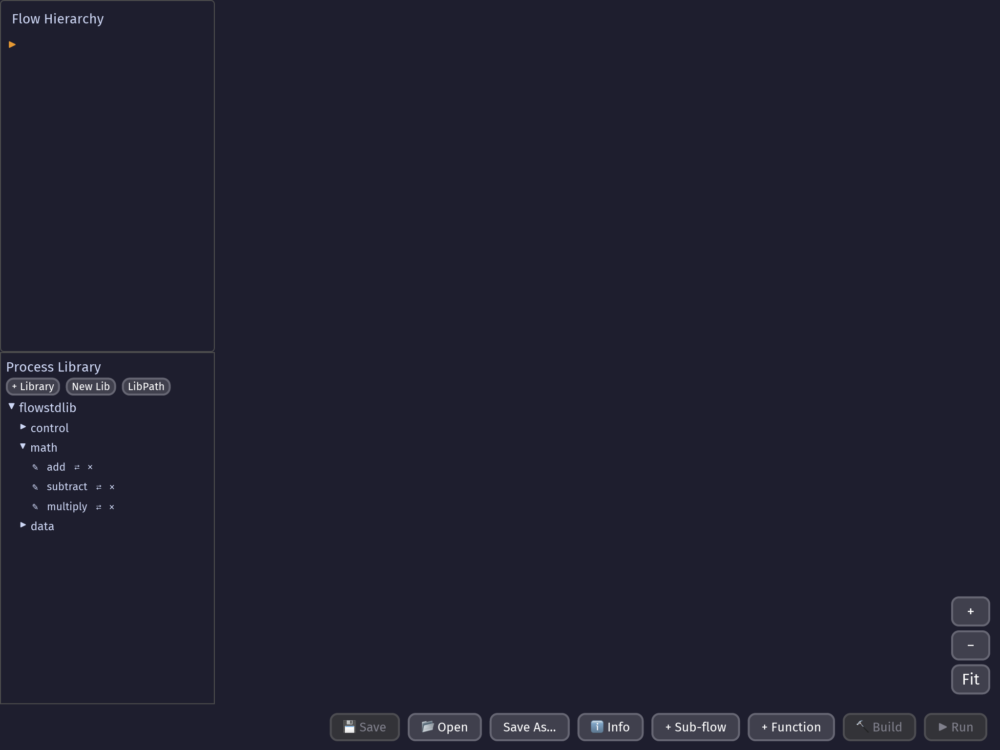
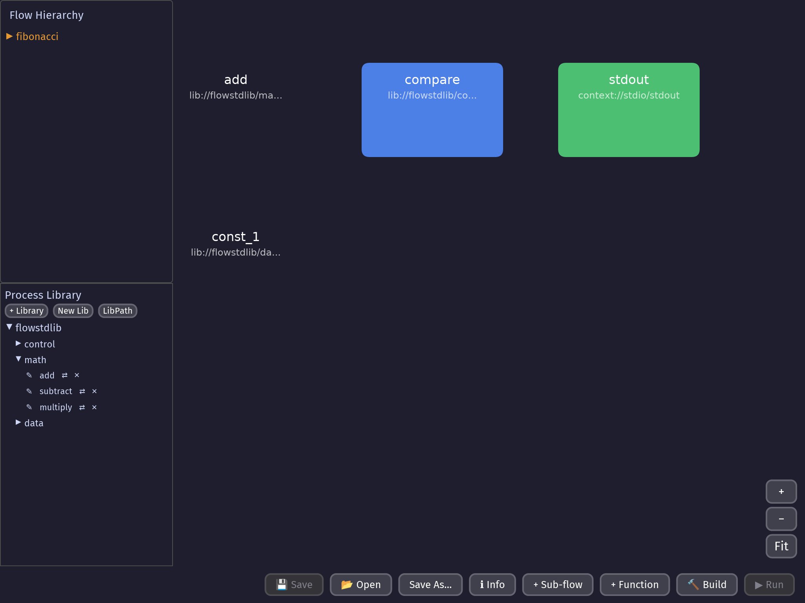
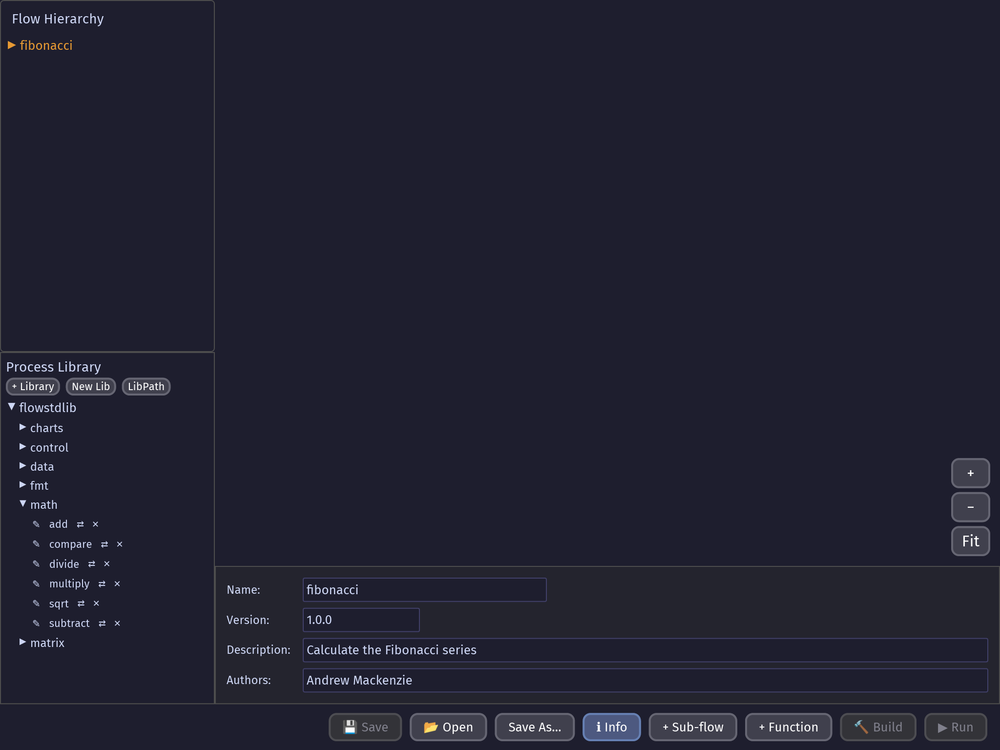
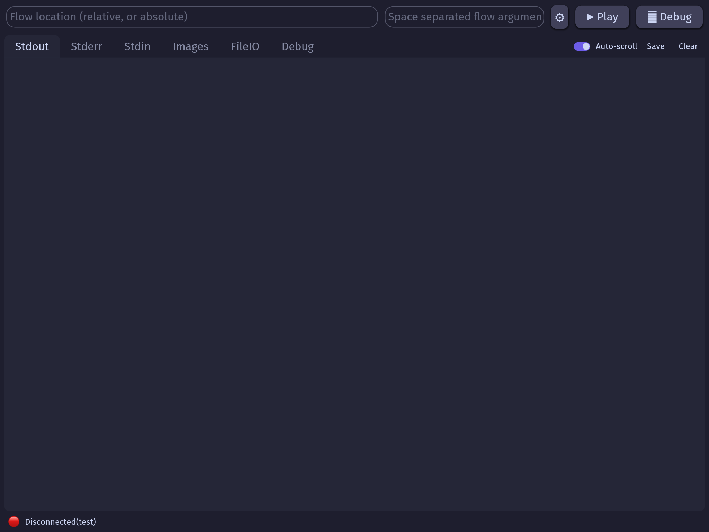
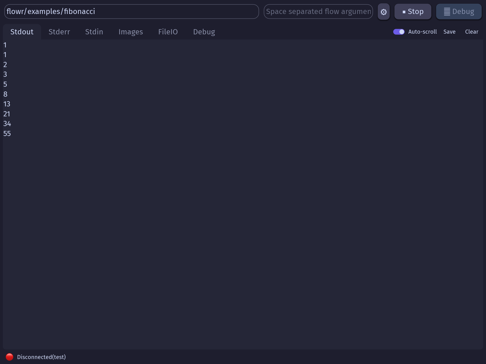
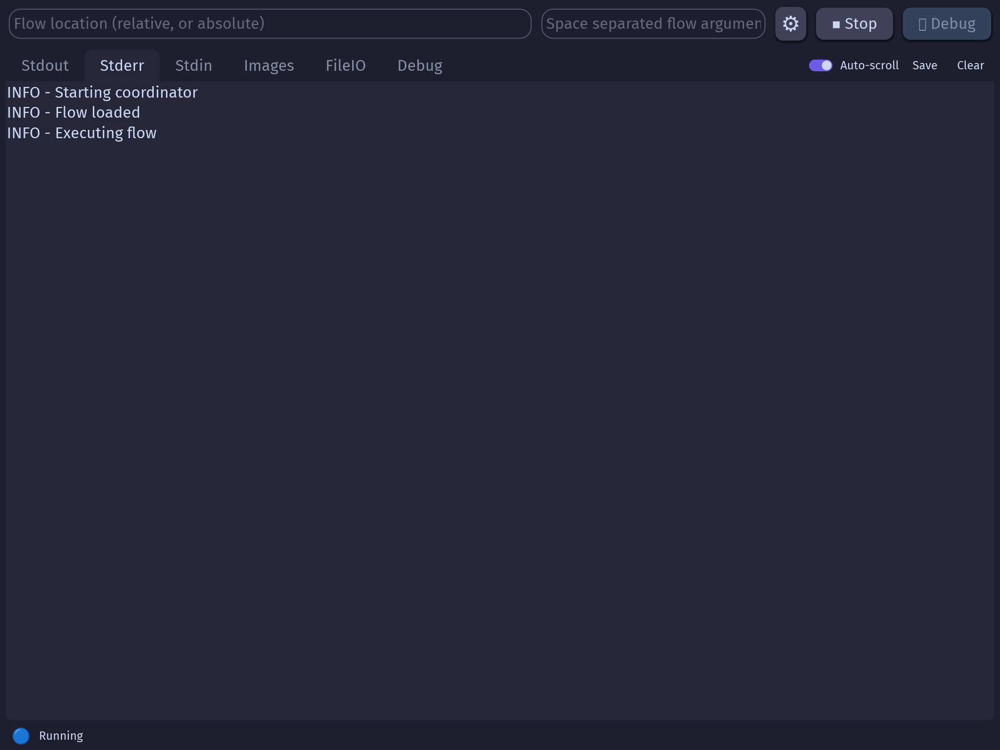
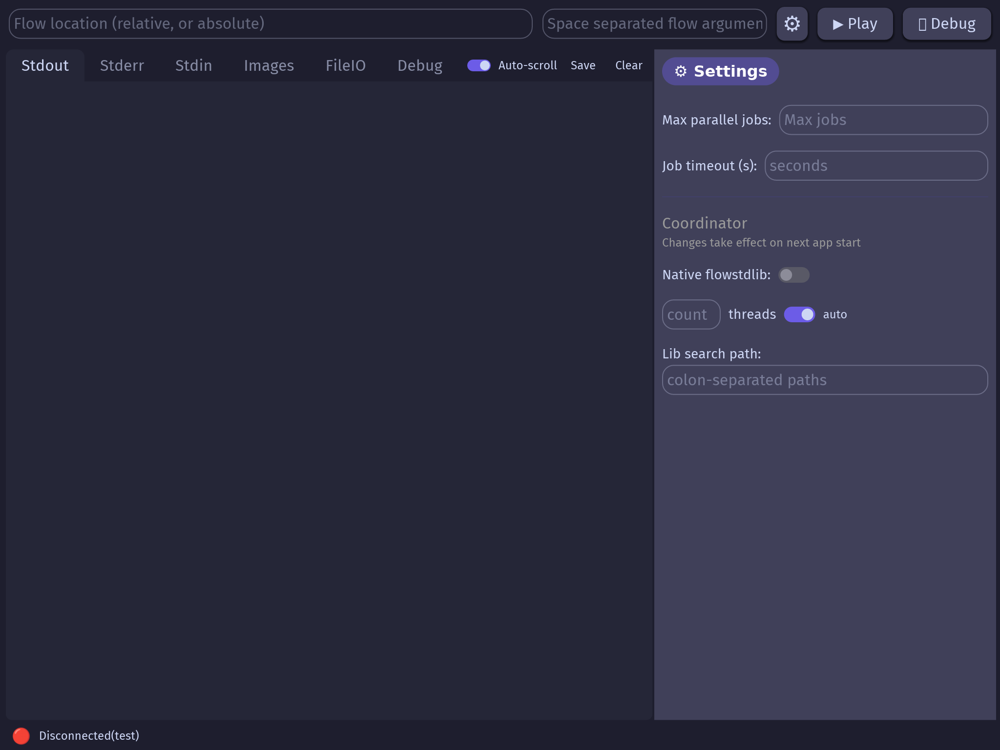
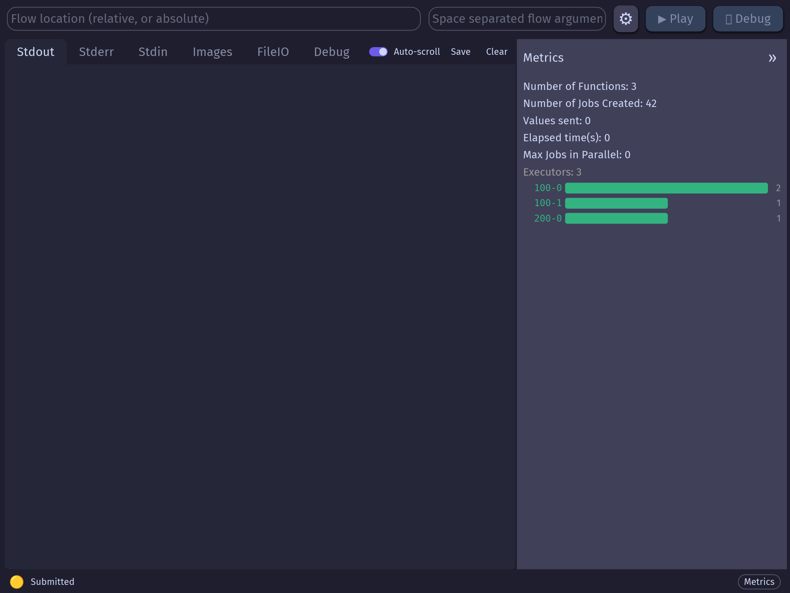

# Screenshots

Automatically generated screenshots of flow's GUI tools (`flowedit` and `flowrgui`).
These images are updated on every push to `master` via the screenshots workflow.

## Flow Editor (`flowedit`)

| Screenshot | Description |
|---|---|
|  | Empty editor on startup |
|  | Fibonacci flow loaded in the editor |
|  | A node selected in the canvas |
|  | Metadata panel showing flow information |

## Flow Runner GUI (`flowrgui`)

| Screenshot | Description |
|---|---|
|  | Initial empty state |
|  | Flow submitted with stdout output |
|  | Stderr tab showing log output |
|  | Settings panel open |
|  | Metrics panel showing execution stats |
