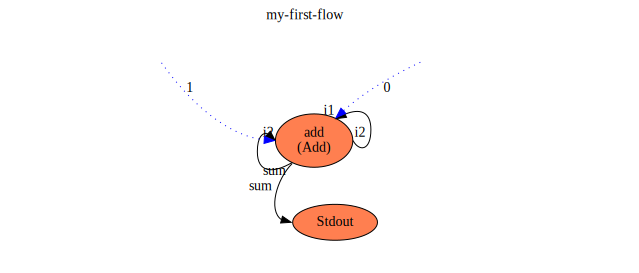

## First flow
Below is a schematic diagram of a 'flow'. 

Without knowing anything about 'flow' and it's detailed semantics 
can you guess what this flow does when executed and what the output to STDOUT will be?

The next section reveals the answer and walks you thru it.