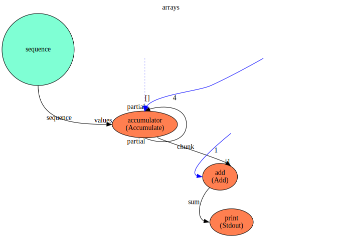
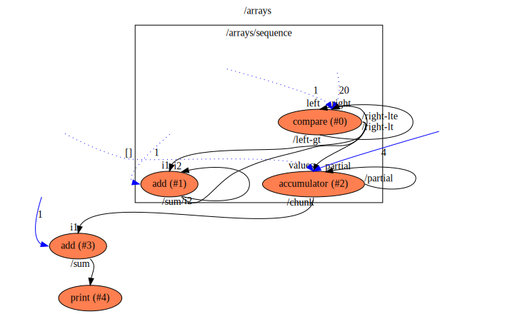

arrays
==

Description
===
Sample to show the capabilities of:
* gathering a stream of outputs of type Object to an input of type Object, of a specified depth. 
This is done by the P2 'composer' (`ComposeArray`) function.
* Decomposing an output of type Array of Objects to a stream of Objects. This is done by the runtime when it sees
a connection from an Array of Type to Type.

* P1 - sequence - generates a stream of outputs of type Number
* P2 - composer - input of type Number of width 4, output of type Array of Number
* P3 - adder    - input of type Number and output of type Number, adding 1 in the process
* P4 - print    - print the output (the original sequence with '1' added to each number)

This sample (with default settings on a multi-core machine) shows parallelism of the add function, dispatching
multiple jobs for it in parallel as the Array of Number output from the previous process is decomposed, creating
a job for each Number. You can see this by using the `-j` option of the runtime to limit the number of outstanding
jobs and the `-m` options to dump metrics after execution. The "Max Number of Parallel Jobs" should be similar or
greater than 4, which is the size of the Array of Numbers formed.

Context Diagram
===

Features Used
===
* Context Flow
* Setting initial value of a Function's inputs
* Multiple connections into and out of functions and values
* Library Functions
* Implicit conversion between arrays of objects and objects done by run-time
* Explicit conversion between a stream of objects and an array using the `compose_array` library function

Functions Diagram
===
This diagram shows the exploded diagram of all functions in all flows, and their connections.
