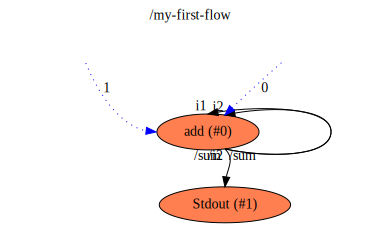

fibonacci
==

Description
===
A flow that generates a Fibonacci series of numbers and prints it out on `stdout`.

Context Diagram
===

<a href="context.dot.svg" target="_blank">Navigate Flow Hierarchy in new tab</a>

Features Used
===
* Context Flow
* Child flow described separately, with named outputs to parent flow
* Connections between Input/Outputs of parent/child flows
* Setting initial value of a Value at startup
* Multiple connections into and out of functions and values
* Runtime Functions used (`stdout` from `flowruntime`)
* Library Functions used (`buffer` and `add` from `flowstdlib`)
* Use of aliases to refer to functions with different names inside a flow
* Connections between flows, functions and values

Functions Diagram
===
This diagram shows the exploded diagram of all functions in all flows, and their connections.
