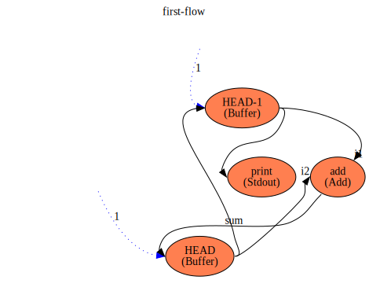
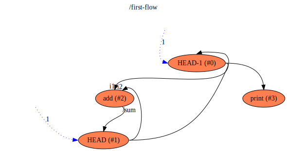

first
==

Description
===
Very simple first flow used to demonstrate a simple flow that actually does something, and who's execution can be followed
step-by-step by a human.

It generates a series of numbers and prints it out on `stdout`, as per diagram below:

See the 'Understanding it' section in the guide to understand
what this flow does and a 'step-by-step walkthrough' of its execution.

Context Diagram
===

Features Used
===
* Context Flow
* Values to store intermediate values
* Setting initial value of a Value at startup
* Multiple connections into and out of functions and values
* Library Functions used (`stdout` and `add` from `flowstdlib`) to print a value and to add two numbers
* Use of aliases to refer to functions with different names
* Connections between functions and values
* Referring to a function's input by name in connections

Functions Diagram
===
This diagram shows the exploded diagram of all functions in all flows, and their connections.
