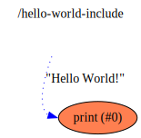

hello-world-include
==

Description
===
A simple flow that prints "Hello World!" on `stdout` using a sub-flow from another directory/project

Context Diagram
===

<a href="context.dot.svg" target="_blank">Navigate Flow Hierarchy in new tab</a>

Features Used
===
* Context Flow
* A nested flow included from a separate file in a different project folder
* A String value that is initialized at start-up
* Library Functions used (`stdout` from `flowstdlib`)
* Connections between a named output of the sub-flow and a function

Functions Diagram
===
This diagram shows the exploded diagram of all functions in all flows, and their connections.
