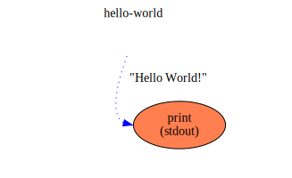

hello-world
==

Description
===
A simple flow that prints "Hello World!" on `stdout`

Context Diagram
===

Click image to navigate flow hierarchy.

Features Used
===
* Context Flow
* A nested flow from a separate file in the same project
* A String value that is initialized at start-up
* Library Functions used (`stdout` from `flowstdlib`)
* Connection between a named output of the sub-flow and the function's input
* Initialization of a flow's output in [flow1](flow1.toml)

Functions Diagram
===
This diagram shows the exploded diagram of all functions in all flows, and their connections.

Click image to view functions graph.