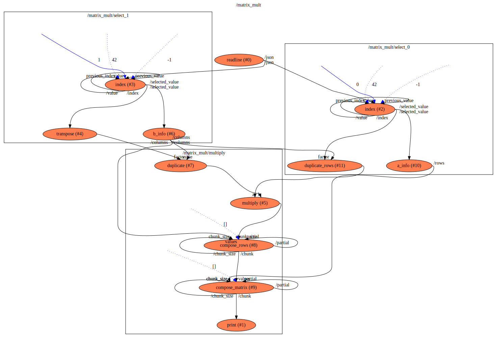

factorial
==

Description
===
A flow that calculates the matrix product of two matrices.

Context Diagram
===

<a href="matrix_mult.dot.svg" target="_blank">Navigate Flow Hierarchy in new tab</a>

Features Used
===
* Context Flow
* Connections between functions
* Loop-back connections to accumulate an array, used to gather Numbers into Array/Number and then Array/Number into
Array/Array/Number (i.e. Matrix)
* Initializing function inputs with values, once and constantly
* Multiple connections into and out of functions
* Library Functions `to_number`, `multiply`, `subtract` from `flowstdlib`
* Library Functions `tap`, `compare` from `flowstdlib`
* Use of aliases to refer to functions with different names inside a flow
* Automatic Array decomposing into the elements the array holds when target function input does not accept the array type

Functions Diagram
===
This diagram shows the exploded diagram of all functions in all flows, and their connections.
