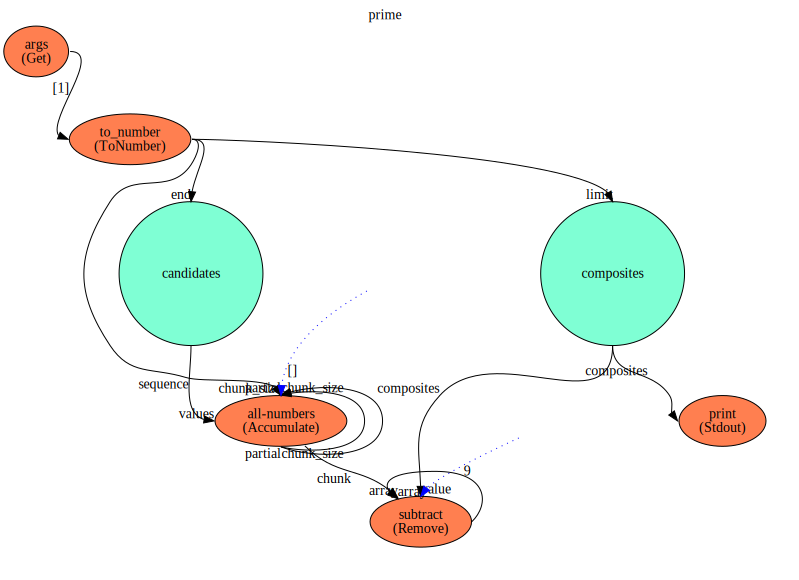
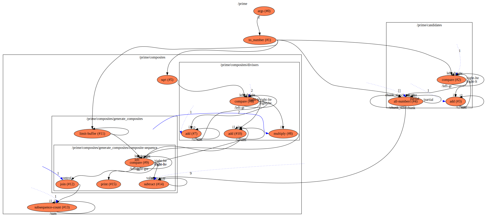

prime
==

WIP

Description
===
A flow that finds prime numbers upto the maximum specified in the input arguments

Context Diagram
===

<a href="prime.dot.svg" target="_blank">Navigate Flow Hierarchy in new tab</a>

Features Used
===
* Context Flow
* Subflows
* Value (with an initial value set)
* Constant Value
* Arguments parsing for the execution
* Constant Value used
* Connections between functions
* Library Functions used
    * `Args` to parse arguments
    * `range` to generate a range of numbers
    * `divide` to divide two numbers
    * `compare` function to produce outputs based on comparing two input values
    * `switch` function to stop or pass a data flow based on another one
    * `ToString` to convert Numbers to Strings
    * `stdout` to print a String to standard output
    
Functions Diagram
===
This diagram shows the exploded diagram of all functions in all flows, and their connections.
