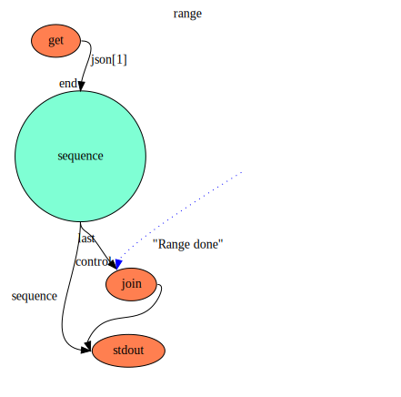
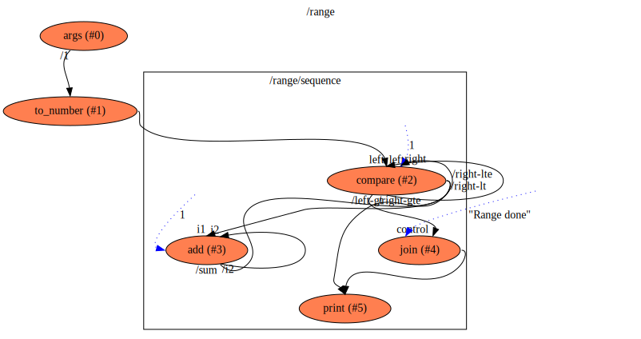

range
==

Description
===
A flow that generates a series of output numbers in a range between two input numbers

Context Diagram
===

<a href="context.dot.svg" target="_blank">Navigate Flow Hierarchy in new tab</a>

Features Used
===
* Context Flow
* Value used (with an initial value set)
* Constant Value used
* Connections between functions
* Two functions of the same name in the same flow, distinguished by `alias`
* Library Functions used
    * `add` to add numbers
    * `ToString` to convert Numbers to Strings
    * `stdout` to print a String to standard output
    * `switch` function to stop or pass a data flow based on another one
    * `compare` function to produce outputs based on comparing two input values
    
Functions Diagram
===
This diagram shows the exploded diagram of all functions in all flows, and their connections.
