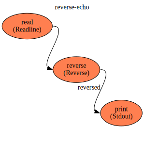
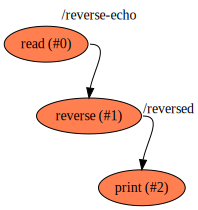

reverse-echo
==

Description
===
Trivial flow that takes a line on `stdin`, reverses it and then prints it on `stdout`

Context Diagram
===

Click image to navigate flow hierarchy.

Features Used
===
* Context Flow
* Library Functions used (`stdin` and `stdout` `reverse` from `flowstdlib`)
* Connections between functions
* Connections from sub-elements of a function's output
* Function with single input (stdout) not requiring input name

Functions Diagram
===
This diagram shows the exploded diagram of all functions in all flows, and their connections.

Click image to view functions graph.