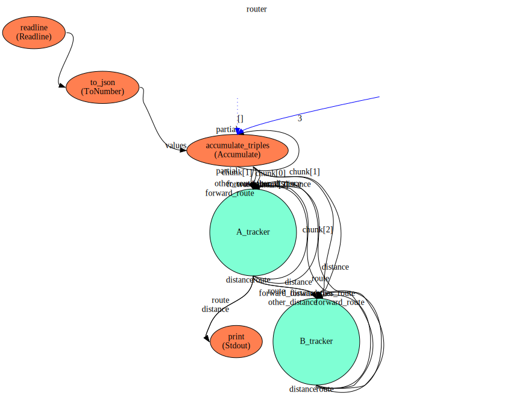
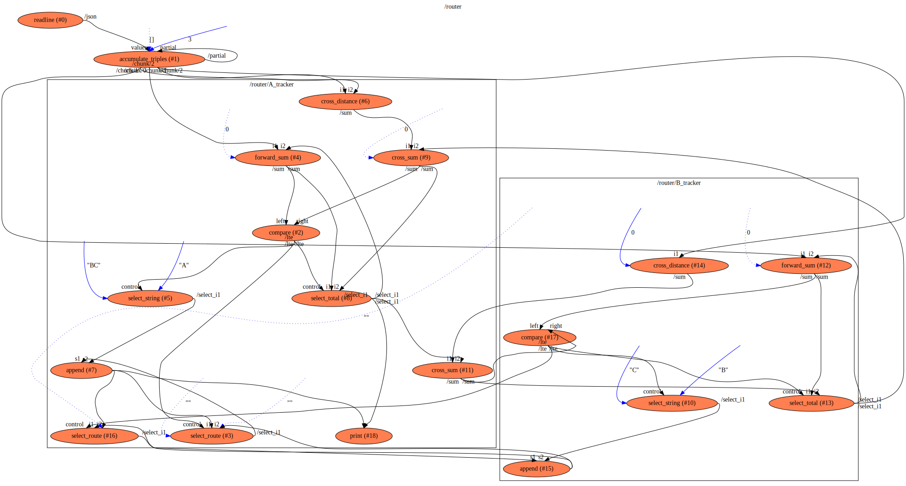

router
==

WIP

Descriptiopn
===
This sample implements the algorithm (as described here https://github.com/andrewdavidmackenzie/router) for
calculating the shortest route from a start-point to an end-point through a simplified road 
network.

Context Diagram
===

Click image to navigate flow hierarchy.

Features Used
===
* The selection of a single Value from an array of values that is one of a number of outputs (not the only 
output). This involves selecting the structure from the output by route, and then the value from that by index. 

Functions Diagram
===
This diagram shows the exploded diagram of all functions in all flows, and their connections.

Click image to view functions graph.