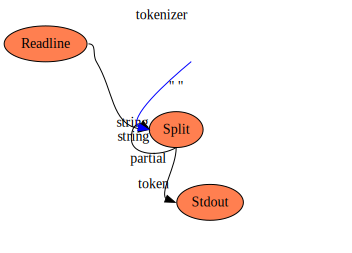
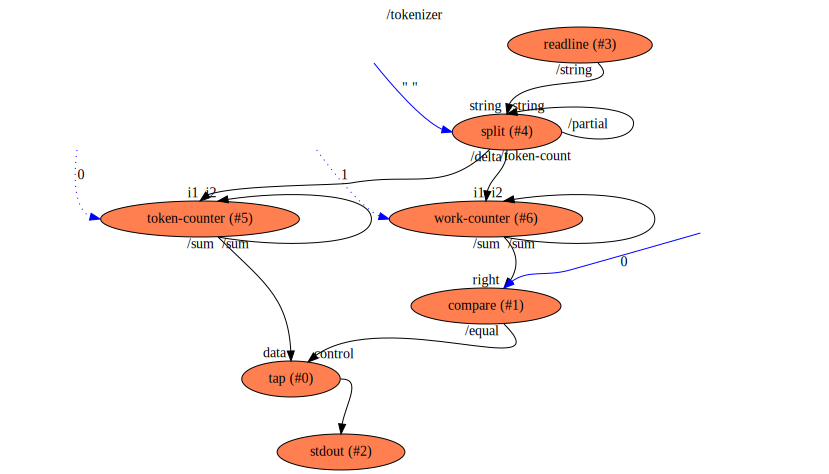

tokenizer
==

Description
===
Sample to show the possible parallelization (depending on the runtime implementation) of splitting a string into
tokens based on a separator.

Context Diagram
===

Features Used
===
* Context Flow
* Setting initializer of a Function's input with a constant initializer
* Library Functions
* Iteration (possibly in parallel) via feedback of partial output values back to the same funtion's input.
* Implicit conversion between arrays of string and string done by run-time, in feedbak loop to the same process

Functions Diagram
===
This diagram shows the exploded diagram of all functions in all flows, and their connections.
